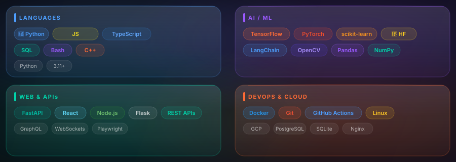

<!-- ═══════════════════════════════════════════════════════════════════
  ONE GLASS — GitHub Identity System
  Design: Samsung One UI 7 × Apple iOS 26 Liquid Glass
  Author: Jay Rathod (@JayRathod07)
  ═══════════════════════════════════════════════════════════════════ -->

<!-- ── HERO BANNER ──────────────────────────────────────────────── -->

 

<!-- ── SOCIAL PILLS ──────────────────────────────────────────────── -->

&nbsp;

&nbsp;

  

<!-- ── PROFILE VIEWS ──────────────────────────────────────────── -->

 

 

<!-- ═══════════════════════════════════════════════════════════════
  SECTION 1 — ABOUT
  ═══════════════════════════════════════════════════════════════ -->

## ◈ &nbsp; About Me &nbsp; ◈

 

<table>
<tr>
<td width="55%" valign="top">

### 🧠 &nbsp; Who I Am

I'm **Jay Rathod** — an **AI/ML Engineer** who believes the best interfaces feel like you're touching glass in the future.

I build things at the intersection of **machine intelligence** and **beautiful design**, where models are fast, code is clean, and every interface has depth.

&nbsp;

### 🎯 &nbsp; Right Now

- 🔬 &nbsp; Researching **LLM fine-tuning** techniques
- 🚀 &nbsp; Building a **production ML pipeline** from scratch
- 📖 &nbsp; Reading: *Designing ML Systems* — Chip Huyen
- 🎧 &nbsp; Obsessing over: Samsung One UI × Apple Liquid Glass

</td>
<td width="45%" valign="top" align="center">

### 📊 &nbsp; GitHub Stats

</td>
</tr>
</table>

 

 

<!-- ═══════════════════════════════════════════════════════════════
  SECTION 2 — TECH STACK (Liquid Glass)
  ═══════════════════════════════════════════════════════════════ -->

## ◈ &nbsp; Tech Stack &nbsp; ◈

The tools in my glass cabinet

 

 

 

<!-- ═══════════════════════════════════════════════════════════════
  SECTION 3 — FEATURED PROJECTS
  ═══════════════════════════════════════════════════════════════ -->

## ◈ &nbsp; Featured Projects &nbsp; ◈

Each project — a pane of glass with something brilliant inside

 

<table>
<tr>
<td width="50%" valign="top">

**🤖 [Claude Nightcrawler](https://github.com/JayRathod07/claude-nightcrawler)**

AI agent that automates Claude.ai prompts overnight via browser automation. Liquid Glass dashboard with real-time task queue.

`Python` `Playwright` `FastAPI` `SQLite`

</td>
<td width="50%" valign="top">

**🧠 [Multi-Agent Research Assistant](https://github.com/JayRathod07/multi-agent-research-assistant)**

Multi-agent LLM system for automated research, summarisation, and knowledge synthesis.

`Python` `LangChain` `OpenAI` `FastAPI`

</td>
</tr>
<tr>
<td width="50%" valign="top">

**📊 [Customer Churn Prediction](https://github.com/JayRathod07/customer-churn-prediction)**

End-to-end ML pipeline predicting customer churn with 94% accuracy. Includes feature engineering, model registry, and REST API.

`Python` `scikit-learn` `Docker` `FastAPI`

</td>
<td width="50%" valign="top">

**🎓 [Capstone Project](https://github.com/JayRathod07/Capstone_project)**

Large-scale ML capstone — deep learning model with full data pipeline, evaluation, and deployment setup.

`Python` `TensorFlow` `Pandas` `Docker`

</td>
</tr>
</table>

 

 

<!-- ═══════════════════════════════════════════════════════════════
  SECTION 4 — ACTIVITY
  ═══════════════════════════════════════════════════════════════ -->

## ◈ &nbsp; Activity &nbsp; ◈

 

<picture>
  <source media="(prefers-color-scheme: dark)"  srcset="./assets/github-snake-dark.svg"/>
  <source media="(prefers-color-scheme: light)" srcset="./assets/github-snake.svg"/>
  
</picture>

  

 

 

<!-- ═══════════════════════════════════════════════════════════════
  SECTION 5 — PHILOSOPHY
  ═══════════════════════════════════════════════════════════════ -->

## ◈ &nbsp; Philosophy &nbsp; ◈

 

> *"The best technology disappears.*
> *It becomes the glass through which you see the world,*
> *not the wall that blocks it."*
>
> — **Jay Rathod**

 

 

<!-- ── FOOTER ────────────────────────────────────────────────────── -->

<!-- ◈  ONE GLASS — Jay Rathod  ◈ -->
