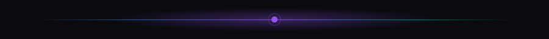
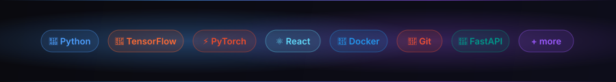
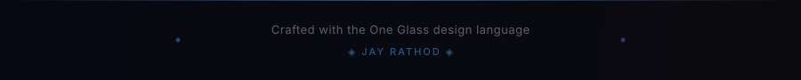

<!-- ═══════════════════════════════════════════════════════════════════
  ONE GLASS — GitHub Identity System
  Design Language: Samsung One UI 7 × Apple iOS 26 Liquid Glass
  Author: Jay Rathod (@JayRathod07)
  Version: 1.0
  ═══════════════════════════════════════════════════════════════════ -->

<!-- ── HERO BANNER ──────────────────────────────────────────────── -->

 

<!-- ── SOCIAL CONTACT PILLS (One UI pill style) ──────────────────── -->

&nbsp;

&nbsp;

  

<!-- ── PROFILE VISIT COUNTER PILL ──────────────────────────────── -->

 

<!-- ── DIVIDER ──────────────────────────────────────────────────── -->

 

<!-- ═══════════════════════════════════════════════════════════════
  SECTION 1 — ABOUT
  ═══════════════════════════════════════════════════════════════ -->

## ◈ &nbsp; About Me &nbsp; ◈

 

<!-- Glass info card rendered as HTML table (works in GitHub MD) -->
<table>
<tr>
<td width="50%" valign="top">

### 🧠 &nbsp; Who I Am

I'm **Jay Rathod** — an **AI/ML Engineer** who believes the best interfaces feel like you're touching glass in the future.

I build things at the intersection of **machine intelligence** and **beautiful design**, where models are fast, code is clean, and every interface has depth.

&nbsp;

### 🎯 &nbsp; Right Now

- 🔬 &nbsp; Researching **LLM fine-tuning** techniques
- 🚀 &nbsp; Building a **production ML pipeline** from scratch
- 📖 &nbsp; Reading: *Designing ML Systems* — Chip Huyen
- 🎧 &nbsp; Obsessing over: Samsung One UI × Apple Liquid Glass

</td>
<td width="50%" valign="top" align="center">

### 📊 &nbsp; GitHub Stats

</td>
</tr>
</table>

 

<!-- ── DIVIDER ──────────────────────────────────────────────────── -->

 

<!-- ═══════════════════════════════════════════════════════════════
  SECTION 2 — TECH STACK
  ═══════════════════════════════════════════════════════════════ -->

## ◈ &nbsp; Tech Stack &nbsp; ◈

The tools in my glass cabinet

 

 

<!-- ── DETAILED TECH BADGES ──────────────────────────────────────── -->

**Languages**

**AI / ML**

**Web & APIs**

**DevOps & Cloud**

 

<!-- ── DIVIDER ──────────────────────────────────────────────────── -->

 

<!-- ═══════════════════════════════════════════════════════════════
  SECTION 3 — FEATURED PROJECTS
  ═══════════════════════════════════════════════════════════════ -->

## ◈ &nbsp; Featured Projects &nbsp; ◈

Each project — a pane of glass with something brilliant inside

 

<!-- GitHub Readme Stats pinned repos -->

&nbsp;

  

&nbsp;

 

<!-- ── DIVIDER ──────────────────────────────────────────────────── -->

 

<!-- ═══════════════════════════════════════════════════════════════
  SECTION 4 — CONTRIBUTION GRAPH
  ═══════════════════════════════════════════════════════════════ -->

## ◈ &nbsp; Activity &nbsp; ◈

 

<!-- Activity snake animation (requires GitHub Action — see README_SETUP.md) -->
<picture>
  <source media="(prefers-color-scheme: dark)" srcset="./assets/github-snake-dark.svg"/>
  <source media="(prefers-color-scheme: light)" srcset="./assets/github-snake.svg"/>
  
</picture>

  

<!-- Most used languages -->

 

<!-- ── DIVIDER ──────────────────────────────────────────────────── -->

 

<!-- ═══════════════════════════════════════════════════════════════
  SECTION 5 — QUOTE / PHILOSOPHY
  ═══════════════════════════════════════════════════════════════ -->

## ◈ &nbsp; Philosophy &nbsp; ◈

 

> *"The best technology disappears.*
> *It becomes the glass through which you see the world,*
> *not the wall that blocks it."*
>
> — **Jay Rathod**

 

<!-- Typing SVG — animated typewriter effect -->

 

<!-- ── FOOTER ────────────────────────────────────────────────────── -->

<!-- ═══════════════════════════════════════════════════════════════
  ◈  ONE GLASS — Jay Rathod  ◈
  Samsung One UI 7 × Apple iOS 26 Liquid Glass
  The design language that is uniquely mine.
  ═══════════════════════════════════════════════════════════════ -->
